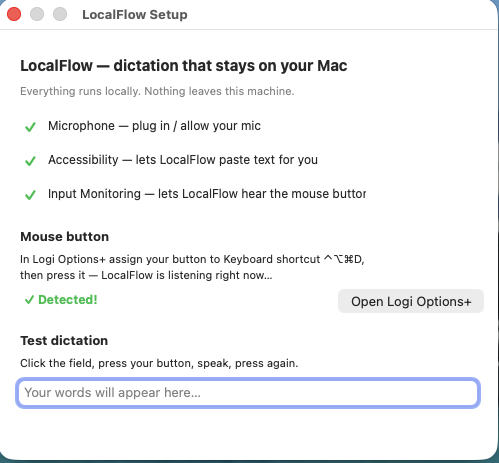
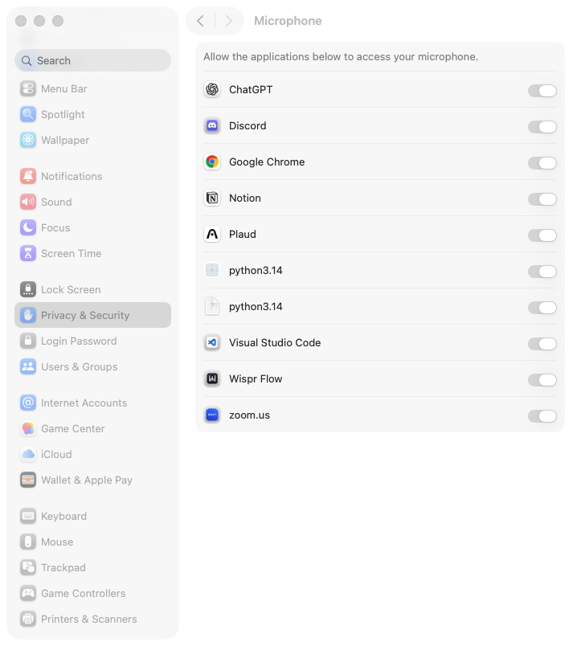
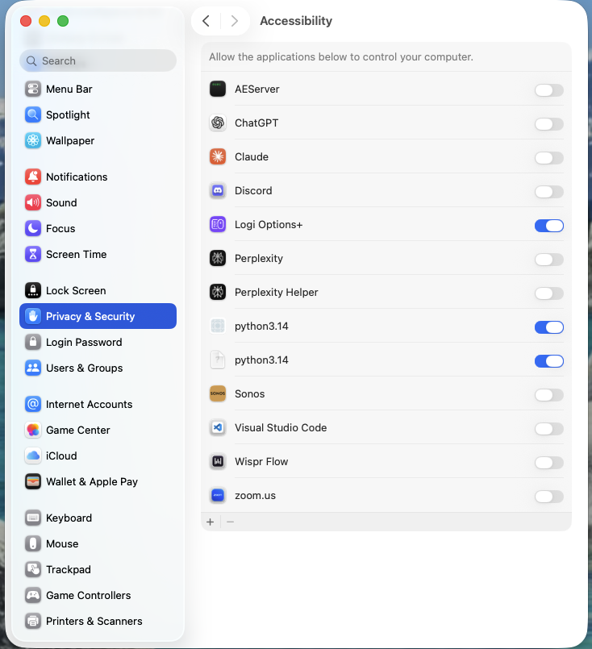
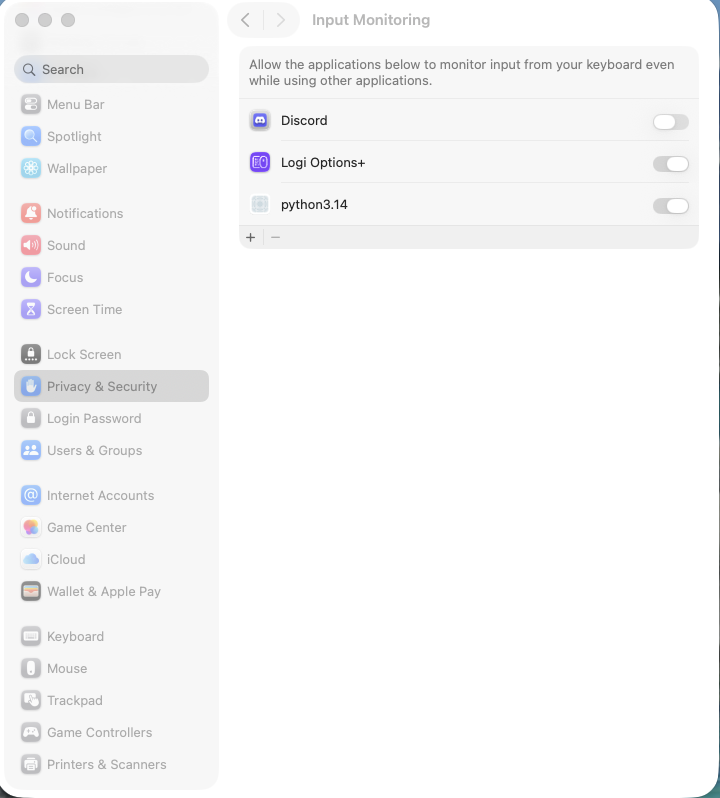

# Installing LocalFlow on your Mac

Total time: about 20 minutes, most of it waiting for a download.
You do not need to know anything technical. Every step tells you exactly
what to click and what you should see.

**What you need:**
- A Mac running macOS 13 (Ventura) or newer. To check: Apple menu (top
  left) > About This Mac.
- About 4 GB of free disk space and a normal internet connection.
- Your Mac login password (you will be asked for it once or twice).

---

## Part 1: Run the installer (about 15 minutes, mostly waiting)

### Step 1: Open Terminal

Press Cmd+Space, type `terminal`, press Return.

✅ You should see a window with plain text and a blinking cursor. This is
just a way to give your Mac typed commands. You will only need it for one
line.

### Step 2: Paste the install command

Copy this whole line, click inside the Terminal window, paste it
(Cmd+V), and press Return:

    curl -fsSL https://raw.githubusercontent.com/getlocalflow/localflow/main/install.sh | bash

✅ Lines of text start appearing. Blue "==>" headings tell you what the
installer is doing at each moment.

### Step 3: Answer the prompts, then wait

Two things may happen during the install. Both are normal:

- **It asks for your password.** Type your Mac login password and press
  Return. (You will not see dots while typing. That is how Terminal works.)
- **A popup offers to install "Command Line Tools".** Click Install, wait
  for it to finish, then run the Step 2 command again.

The big wait is "Downloading the speech model (~1.6 GB)". On typical home
Wi-Fi this takes about 10 minutes. Leave the window open.

✅ Done when you see: "Done installing. One last thing: permissions."

---

## Part 2: Give LocalFlow its 3 permissions (about 3 minutes)

macOS requires your explicit permission for three things. A LocalFlow
setup window opens automatically and shows a live checkmark for each one.

The window also shows a Mouse button section and a small Test dictation
box. Ignore the mouse section for now (it is covered at the end of this
guide). After your three checkmarks are green, you can try dictating into the
Test dictation box, or follow Part 3 below.

### Step 4: Microphone

Click "Open Settings" next to Microphone in the setup window. When macOS
asks, click **Allow**.

✅ The Microphone row in the setup window turns to a green checkmark.

### Step 5: Accessibility

This lets LocalFlow type the text for you. Click "Open Settings" next to
Accessibility. macOS opens System Settings. Turn ON the switch next to
the Python entry, then enter your password if asked.

✅ Back in the setup window, the Accessibility row turns green.

### Step 6: Input Monitoring

This lets LocalFlow notice the shortcut key. Same dance: click "Open
Settings", turn ON the switch in System Settings.

LocalFlow needs a quick restart to notice this one. Click the LocalFlow
icon in the menu bar (it shows ⚠️ right now; after this step it becomes
🎤) and choose Quit LocalFlow. Wait about 10 seconds. LocalFlow starts
again on its own and the icon returns as 🎤.

✅ To see all three green checkmarks: click the menu bar 🎤 icon and
choose Fix Permissions…. All three rows now show green. Close the window.

---

## Part 3: Your first dictation (1 minute)

### Step 7: Open any app you can type in

Notes, Mail, a web browser search box, anything. Click so the cursor is
blinking in a text area.

✅ You see a blinking text cursor where you clicked.

### Step 8: Press Ctrl+Option+Cmd+D

Hold Control, Option, and Command with your left hand and tap D.

✅ A small pill appears at the bottom-center of your screen with a moving
waveform. It is listening.

### Step 9: Say something

Try: "Hello, this is my first dictation with LocalFlow. It runs entirely
on my own computer."

✅ The pill's waveform moves as you speak.

### Step 10: Press Ctrl+Option+Cmd+D again

✅ The pill shows a spinner for a moment, then a checkmark, and your
sentence appears at your cursor, with punctuation. That is it. You now
have private dictation everywhere on your Mac.

---

## Nice upgrade: one-click dictation from a mouse button

If your mouse has spare side buttons and software (for example Logitech's
Logi Options+):

1. Open your mouse software.
2. Pick a spare button and choose "Keyboard shortcut" as its action.
3. Press Ctrl+Option+Cmd+D to record it as the shortcut.

Now that button starts and stops dictation with one thumb click.

---

## If something is not working

| What you see | What it means | Fix |
|---|---|---|
| Pressing the shortcut does nothing, no pill | Input Monitoring permission is missing | Click the LocalFlow menu bar icon (🎤 or ⚠️) > Fix Permissions…, grant Input Monitoring, then quit LocalFlow from the 🎤 menu (it restarts by itself in a few seconds) |
| Pill appears but no text is typed | Accessibility permission is missing | Click the menu bar 🎤 icon > Fix Permissions… and grant Accessibility. Then click 🎤 > Copy Last Transcript and press Cmd+V to paste what you said. |
| Pill says it cannot hear you | Wrong microphone selected | System Settings > Sound > Input: pick the mic you want, speak, watch the level meter move |
| "Transcription failed" | The model hiccuped; your audio was saved | Menu bar 🎤 > Retry Last Recording |
| No LocalFlow icon (🎤 or ⚠️) in the menu bar at all | LocalFlow is not running | Open Terminal and run: `launchctl kickstart -k gui/$(id -u)/com.localflow.daemon` |

Still stuck? Check the log for clues:

    tail -20 ~/Library/Logs/LocalFlow/localflow.log

## Uninstalling

    bash ~/LocalFlow/uninstall.sh

It stops LocalFlow, removes autostart, and asks before deleting anything
of yours.
